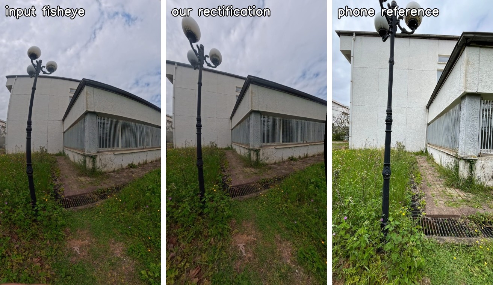
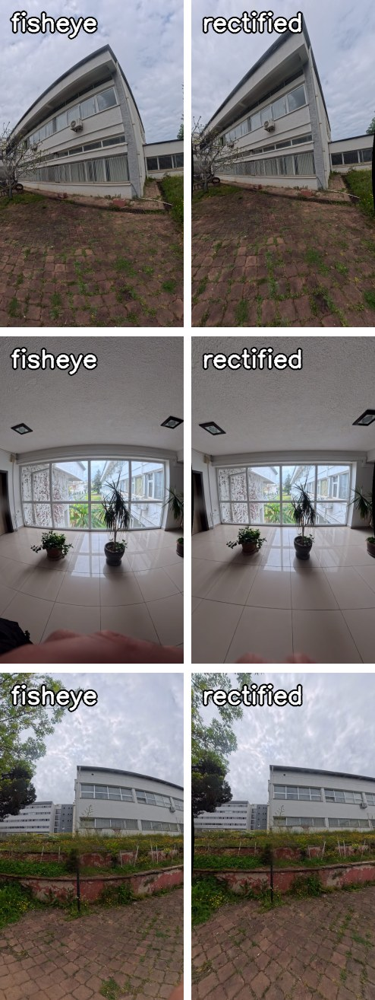

# Zernike-Parametrized Single-Image Fisheye Calibration

Calibrate an **unknown fisheye lens from a single image** using only the
straight lines that already exist in the scene, then rectify the image into a
distortion-free rectilinear view. No checkerboard, no multi-view capture, no
prior knowledge of the lens.



*Left:* raw fisheye input. *Middle:* our rectified output. *Right:* a normal
phone capture of the same scene, used only as an independent visual reference
(never seen during calibration).

---

## Why this project

Fisheye lenses bend straight world lines into curves. The classical fix is
*plumb-line self-calibration*: find the distortion model that makes
world-straight lines straight again. This repository revisits that idea with
three additions that make the optimization more robust and the result more
interpretable:

| Contribution | What it does |
| --- | --- |
| **Zernike radial model** | Uses the orthogonal `R_n^1` Zernike polynomials from optical aberration theory as the radial map, instead of a generic polynomial. Better numerical conditioning and natural high-order regularization. |
| **Physical projection priors** | Seeds the multi-start optimizer with the four classical fisheye projections (equidistant, equisolid, stereographic, orthographic) so the solver starts in physically plausible basins. |
| **Rectified-space Hough bootstrap** | Calibrates once, rectifies, runs a Hough detector on the *already-straight* output, maps new segments back into the input, and re-calibrates only if an out-of-sample metric improves. |
| **Confidence scoring** | A six-component reliability score (line count, spatial/radial coverage, fit quality, edge-angle plausibility, generalization) that flags untrustworthy calibrations. |

---

## Results at a glance

Before → after on three scene types (building exterior, glass interior, slab block):



On a paired dataset of 5 scenes (fisheye + smartphone), each calibrated
**independently**:

| Metric | Value |
| --- | --- |
| Cross-scene half-angle consistency (σ of θ(1)) | **0.042°** |
| Mean model-free line straightness (Hough) | **0.76 px** (sub-pixel) |
| Mean train / validation RMSE (rectified plane) | 0.0053 / 0.0073 |
| Physical projection prior wins the multi-start | **4 / 5 scenes** |

The same camera converging to within `0.05°` across independent scenes is a
built-in cross-validation: the pipeline recovers a property of the *lens*, not
of any single image.

---

## Method overview

For an input pixel `(u, v)` the model produces a 3D ray angle `θ` from the
normalized image radius `r̂` through a Zernike radial map:

```
θ = g(r̂) = c₁·R₁¹(r̂) + c₃·R₃¹(r̂) + c₅·R₅¹(r̂) + c₇·R₇¹(r̂)
```

The full parameter vector is `[cx, cy, c₁, c₃, c₅, c₇, sx, sy, p₁, p₂]`:
optical centre, four radial coefficients, anisotropic scales, and Brown–Conrady
tangential terms. Calibration minimizes the perpendicular distance of each
constraint line's points to its best-fit 2D line in the rectified plane, under
a robust `soft_l1` loss with monotonicity / smoothness / centre / edge-angle
regularizers, solved by trust-region least squares from 12 warm starts.

```
input fisheye
   │
   ├─ line extraction (Canny + LSD + quality filtering)   ── or manual clicks
   │
   ├─ train / validation split
   │
   ├─ multi-start calibration  (linear + 9 physical priors + random)
   │      └─ alternating rounds with outlier trimming
   │
   ├─ rectified-space Hough bootstrap  (accept only if metric improves)
   │
   ├─ confidence assessment
   │
   └─ inverse map → cv2.remap → rectified output
```

---

## Repository structure

```
fisheye_new/
├── fisheye_zernike_v2/          # active project (Zernike-first pipeline)
│   ├── fisheye_zernike/
│   │   ├── model.py             #  poly4 + Zernike radial models
│   │   ├── loss.py              #  straightness loss + regularizers
│   │   ├── lines.py             #  automatic / manual line extraction
│   │   ├── optimize.py          #  multi-start + physical projection priors
│   │   ├── hough_bootstrap.py   #  rectified-space Hough refinement
│   │   ├── diagnostics.py       #  confidence + Zernike coefficient summary
│   │   ├── paired_eval.py       #  fisheye-vs-reference evaluation metrics
│   │   ├── rectify.py           #  undistortion map + rendering + auto-crop
│   │   └── cli.py               #  command-line entry point
│   ├── run_paired_eval.py       #  batch paired evaluation over a dataset
│   └── tests/                   #  synthetic recovery + smoke tests
├── legacy_poly4/                # earlier poly4 pipeline (kept as baseline)
├── data/
│   ├── raw/                     #  input images (paired Instax/Iphone + others)
│   └── annotations/             #  manual line JSON files
├── outputs/                     # generated results (git-ignored)
├── paper/                       # IEEE A4 LaTeX paper draft + figures
└── assets/                      # images used in this README
```

---

## Installation

```bash
python -m pip install -r fisheye_zernike_v2/requirements.txt
# numpy, scipy, opencv-python, matplotlib
```

---

## Usage

### Calibrate and rectify one image

```bash
cd fisheye_zernike_v2

python -m fisheye_zernike.cli \
  --input ../data/raw/Instax_001.jpeg \
  --output rectified.jpg \
  --debug-dir debug \
  --auto-lines \
  --model zernike4 \
  --projection-priors \
  --hough-bootstrap \
  --compare-models
```

### Manual line annotation (sparse / cluttered scenes)

```bash
# 1) click straight-line points, save to JSON, then exit
python -m fisheye_zernike.cli --input ../data/raw/Instax_001.jpeg \
  --output unused.jpg --debug-dir debug_pick \
  --annotate-manual ../data/annotations/manual_001.json --annotate-only

# 2) calibrate from those lines
python -m fisheye_zernike.cli --input ../data/raw/Instax_001.jpeg \
  --output rectified_manual.jpg --debug-dir debug_manual \
  --manual-lines ../data/annotations/manual_001.json --model zernike4
```

### Batch paired evaluation

Processes every `Instax_XXX` / `Iphone_XXX` pair under `data/raw/`, computes
calibration + similarity metrics, and writes an aggregate table:

```bash
cd fisheye_zernike_v2
python run_paired_eval.py
# results in outputs/paired_eval/{summary.json, summary.csv, aggregate_table.txt}
```

### Tests

```bash
cd fisheye_zernike_v2
python -m unittest discover -s tests -v
```

---

## The paper

A full write-up is in [`paper/`](paper/) (IEEE A4 conference format). Build it
with any LaTeX toolchain:

```bash
cd paper
pdflatex main.tex && pdflatex main.tex
```

Or upload `paper/` to [Overleaf](https://www.overleaf.com) and compile with
pdfLaTeX. Key figures:

| Estimated radial map vs classical projections | Cross-scene consistency |
| --- | --- |
|  |  |

---

## Citation

```bibtex
@inproceedings{bingol2026zernike,
  title     = {Zernike-Parametrized Single-Image Fisheye Calibration with
               Physical Projection Priors and Rectified-Space Hough Bootstrap},
  author    = {Bing\"{o}l, Muhammet Do\u{g}ukan and Nabiyev, Vasif},
  booktitle = {Proceedings of the (to appear)},
  year      = {2026}
}
```

---

## Authors

- **Muhammet Doğukan Bingöl** — Karadeniz Technical University, Trabzon, Türkiye
- **Prof. Vasif Nabiyev** — Karadeniz Technical University, Trabzon, Türkiye

---

## License

Released for academic and research use. See repository for details.
